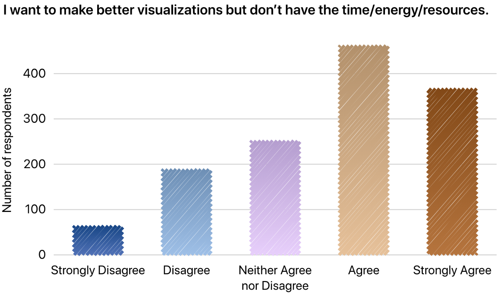
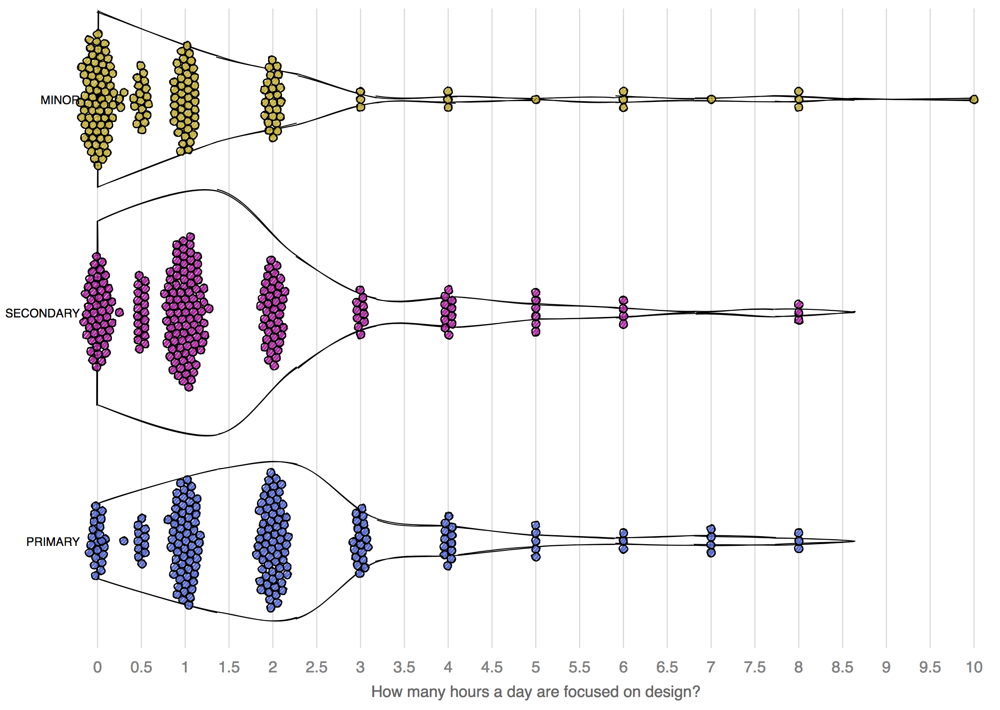

Results from a Data Visualization Surveys:

Feb 27 - March 8th 2017

May 9 - May 29 2018

May 13 - June 16 2019

======

Survey results in the data folder. SPSS formatted 2019 results provided by Tabx.

# 2019

# 2018

# 2017

